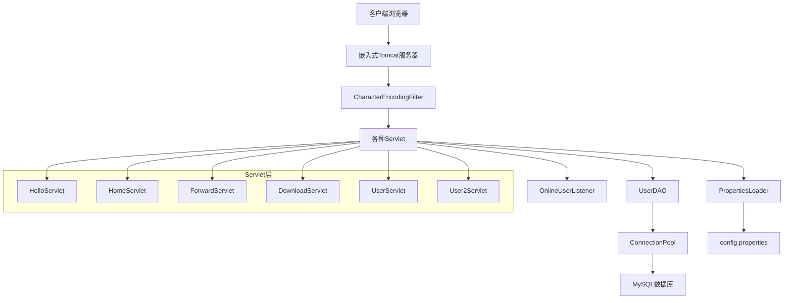
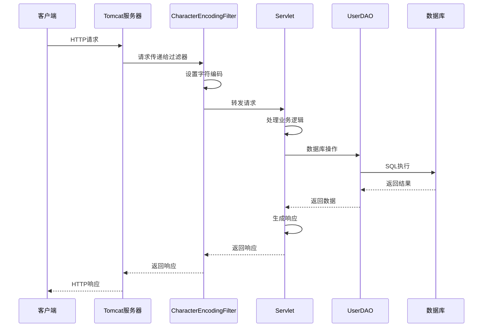

# Java Servlet 学习项目

这是一个全面的Java Servlet学习项目，展示了Servlet技术的核心概念和实际应用。项目通过多个示例Servlet和相关组件，帮助学习者深入理解Servlet的工作原理和开发模式。

## 目录

- [Java Servlet 学习项目](#java-servlet-学习项目)
  - [目录](#目录)
  - [项目架构图](#项目架构图)
  - [Servlet请求处理流程](#servlet请求处理流程)
  - [项目概述](#项目概述)
  - [项目结构](#项目结构)
  - [Servlet 知识点详解](#servlet-知识点详解)
    - [1. Servlet 基础](#1-servlet-基础)
      - [1.1 Servlet 生命周期](#11-servlet-生命周期)
      - [1.2 Servlet 配置与映射](#12-servlet-配置与映射)
    - [2. 请求与响应处理](#2-请求与响应处理)
      - [2.1 请求参数处理](#21-请求参数处理)
      - [2.2 响应生成](#22-响应生成)
      - [2.3 字符编码处理](#23-字符编码处理)
    - [3. Servlet 高级特性](#3-servlet-高级特性)
      - [3.1 请求转发与重定向](#31-请求转发与重定向)
      - [3.2 Cookie 处理](#32-cookie-处理)
      - [3.3 过滤器 (Filter)](#33-过滤器-filter)
      - [3.4 监听器 (Listener)](#34-监听器-listener)
    - [4. 数据库操作](#4-数据库操作)
      - [4.1 JDBC 基础操作](#41-jdbc-基础操作)
      - [4.2 数据库连接池](#42-数据库连接池)
      - [4.3 事务处理](#43-事务处理)
    - [5. RESTful API 设计](#5-restful-api-设计)
    - [6. 嵌入式Tomcat配置](#6-嵌入式tomcat配置)
    - [7. 跨域资源共享 (CORS)](#7-跨域资源共享-cors)
    - [8. 配置管理](#8-配置管理)
  - [项目运行指南](#项目运行指南)
    - [环境要求](#环境要求)
    - [数据库设置](#数据库设置)
    - [运行步骤](#运行步骤)
  - [学习路径建议](#学习路径建议)
  - [扩展学习建议](#扩展学习建议)
  - [总结](#总结)

## 项目架构图



## Servlet请求处理流程



## 项目概述

本项目是一个基于Java Servlet的Web应用程序，使用嵌入式Tomcat服务器运行。项目涵盖了Servlet基础、请求处理、响应生成、过滤器、监听器、数据库连接、事务处理等多个方面的知识点。

## 项目结构

```
src/
├── main/
│   ├── java/com/example/
│   │   ├── Application.java          # 应用程序入口，启动嵌入式Tomcat
│   │   ├── HelloServlet.java         # 基础Servlet示例，处理GET/POST请求
│   │   ├── HomeServlet.java          # 首页Servlet，演示请求转发
│   │   ├── ForwardServlet.java       # 转发Servlet示例，演示Cookie操作
│   │   ├── DownloadServlet.java      # 文件下载Servlet示例
│   │   ├── UserServlet.java          # 用户管理CRUD操作Servlet
│   │   ├── User2Servlet.java         # 事务处理Servlet示例
│   │   ├── CharacterEncodingFilter.java # 字符编码过滤器
│   │   ├── OnlineUserListener.java   # 在线用户统计监听器
│   │   ├── TomcatConfig.java         # Tomcat配置类
│   │   ├── User.java                 # 用户实体类
│   │   ├── UserDAO.java              # 用户数据访问对象
│   │   ├── DBUtil.java               # 数据库工具类
│   │   ├── ConnectionPool.java       # 数据库连接池
│   │   └── PropertiesLoader.java     # 配置文件加载工具
│   ├── resources/
│   │   └── config.properties         # 数据库配置文件
│   └── webapp/
│       ├── WEB-INF/
│       │   └── web.xml              # Web应用部署描述文件
│       ├── test-forward.html        # 转发功能测试页面
│       ├── test-user.html           # 用户管理测试页面
│       └── test-user2.html          # 事务处理测试页面
├── init.sql                         # 数据库初始化脚本
├── pom.xml                          # Maven项目配置文件
└── start.bat                        # Windows启动脚本
```

## Servlet 知识点详解

### 1. Servlet 基础

#### 1.1 Servlet 生命周期
项目中的多个Servlet（如[`HelloServlet`](src/main/java/com/example/HelloServlet.java)）展示了Servlet的完整生命周期：
- **初始化阶段**：[`init()`](src/main/java/com/example/HelloServlet.java#L21)方法在Servlet首次创建时调用，用于初始化资源
- **服务阶段**：[`doGet()`](src/main/java/com/example/HelloServlet.java#L35)、[`doPost()`](src/main/java/com/example/HelloServlet.java#L92)等方法处理客户端请求
- **销毁阶段**：[`destroy()`](src/main/java/com/example/HelloServlet.java#L188)方法在Servlet卸载时调用，释放资源

#### 1.2 Servlet 配置与映射
项目通过[`TomcatConfig`](src/main/java/com/example/TomcatConfig.java)类以编程方式配置Servlet映射：
```java
Tomcat.addServlet(ctx, "helloServlet", new HelloServlet());
ctx.addServletMappingDecoded("/hello", "helloServlet");
```

### 2. 请求与响应处理

#### 2.1 请求参数处理
[`HelloServlet`](src/main/java/com/example/HelloServlet.java)展示了多种请求参数处理方式：
- 查询参数：[`request.getParameterMap()`](src/main/java/com/example/HelloServlet.java#L53)
- JSON请求体：通过[`BufferedReader`](src/main/java/com/example/HelloServlet.java#L119)读取并解析
- 表单数据：通过[`request.getParameterMap()`](src/main/java/com/example/HelloServlet.java#L139)获取

#### 2.2 响应生成
项目展示了多种响应格式：
- JSON响应：使用[`Jackson`](src/main/java/com/example/HelloServlet.java#L86)库生成JSON
- 文件下载：[`DownloadServlet`](src/main/java/com/example/DownloadServlet.java)演示了文件下载实现
- 错误响应：通过[`response.setStatus()`](src/main/java/com/example/UserServlet.java#L28)设置HTTP状态码

#### 2.3 字符编码处理
项目通过[`CharacterEncodingFilter`](src/main/java/com/example/CharacterEncodingFilter.java)统一处理字符编码：
```java
request.setCharacterEncoding(encoding);
response.setCharacterEncoding(encoding);
```

### 3. Servlet 高级特性

#### 3.1 请求转发与重定向
[`HomeServlet`](src/main/java/com/example/HomeServlet.java)和[`ForwardServlet`](src/main/java/com/example/ForwardServlet.java)演示了请求转发：
```java
request.getRequestDispatcher("/hello").forward(request, response);
```

#### 3.2 Cookie 处理
[`ForwardServlet`](src/main/java/com/example/ForwardServlet.java)展示了Cookie的创建和读取：
```java
Cookie newCookie = new Cookie("forwardCookie", String.valueOf(System.currentTimeMillis()));
response.addCookie(newCookie);
Cookie[] cookie = request.getCookies();
```

#### 3.3 过滤器 (Filter)
[`CharacterEncodingFilter`](src/main/java/com/example/CharacterEncodingFilter.java)实现了过滤器接口，用于统一处理请求和响应的字符编码：
- [`init()`](src/main/java/com/example/CharacterEncodingFilter.java#L15)：过滤器初始化
- [`doFilter()`](src/main/java/com/example/CharacterEncodingFilter.java#L23)：执行过滤逻辑
- [`destroy()`](src/main/java/com/example/CharacterEncodingFilter.java#L35)：过滤器销毁

#### 3.4 监听器 (Listener)
[`OnlineUserListener`](src/main/java/com/example/OnlineUserListener.java)实现了[`HttpSessionListener`](src/main/java/com/example/OnlineUserListener.java#L10)接口，用于统计在线用户数：
- [`sessionCreated()`](src/main/java/com/example/OnlineUserListener.java#L13)：会话创建时调用
- [`sessionDestroyed()`](src/main/java/com/example/OnlineUserListener.java#L29)：会话销毁时调用

### 4. 数据库操作

#### 4.1 JDBC 基础操作
[`UserDAO`](src/main/java/com/example/UserDAO.java)类展示了完整的JDBC CRUD操作：
- 创建：[`add()`](src/main/java/com/example/UserDAO.java#L12)方法
- 读取：[`get()`](src/main/java/com/example/UserDAO.java#L75)和[`getAll()`](src/main/java/com/example/UserDAO.java#L96)方法
- 更新：[`update()`](src/main/java/com/example/UserDAO.java#L40)方法
- 删除：[`delete()`](src/main/java/com/example/UserDAO.java#L59)方法

#### 4.2 数据库连接池
[`ConnectionPool`](src/main/java/com/example/ConnectionPool.java)实现了一个简单的数据库连接池：
- 单例模式：[`getInstance()`](src/main/java/com/example/ConnectionPool.java#L38)方法
- 连接获取：[`getConnection()`](src/main/java/com/example/ConnectionPool.java#L84)方法
- 连接释放：[`releaseConnection()`](src/main/java/com/example/ConnectionPool.java#L118)方法
- 连接池管理：[`initializePool()`](src/main/java/com/example/ConnectionPool.java#L48)和[`closeAll()`](src/main/java/com/example/ConnectionPool.java#L153)方法

#### 4.3 事务处理
[`User2Servlet`](src/main/java/com/example/User2Servlet.java)和[`UserDAO`](src/main/java/com/example/UserDAO.java)展示了事务处理：
```java
conn.setAutoCommit(false); // 开启事务
// 执行多个数据库操作
conn.commit(); // 提交事务
conn.rollback(); // 回滚事务
```

### 5. RESTful API 设计

[`UserServlet`](src/main/java/com/example/UserServlet.java)实现了RESTful风格的API设计：
- GET `/user`：获取所有用户
- GET `/user?id=1`：获取指定ID的用户
- POST `/user`：创建新用户
- PUT `/user`：更新用户信息
- DELETE `/user?id=1`：删除指定ID的用户

### 6. 嵌入式Tomcat配置

[`Application`](src/main/java/com/example/Application.java)类展示了如何使用嵌入式Tomcat：
- Tomcat实例创建：[`new Tomcat()`](src/main/java/com/example/Application.java#L18)
- 端口设置：[`tomcat.setPort(8080)`](src/main/java/com/example/Application.java#L21)
- 上下文配置：[`tomcat.addContext()`](src/main/java/com/example/Application.java#L26)
- Servlet配置：[`TomcatConfig.configureServlets(ctx)`](src/main/java/com/example/Application.java#L42)

### 7. 跨域资源共享 (CORS)

项目中的多个Servlet（如[`HelloServlet`](src/main/java/com/example/HelloServlet.java)和[`DownloadServlet`](src/main/java/com/example/DownloadServlet.java)）实现了CORS支持：
```java
response.setHeader("Access-Control-Allow-Origin", "*");
response.setHeader("Access-Control-Allow-Methods", "GET, POST, OPTIONS");
response.setHeader("Access-Control-Allow-Headers", "Content-Type");
```

### 8. 配置管理

[`PropertiesLoader`](src/main/java/com/example/PropertiesLoader.java)类展示了如何加载和使用配置文件：
- UTF-8编码支持：[`new InputStreamReader(input, StandardCharsets.UTF_8)`](src/main/java/com/example/PropertiesLoader.java#L35)
- 配置项获取：[`getProperty()`](src/main/java/com/example/PropertiesLoader.java#L48)方法

## 项目运行指南

### 环境要求

- JDK 1.8 或更高版本
- Maven 3.6 或更高版本
- MySQL 5.7 或更高版本

### 数据库设置

1. 创建数据库并执行初始化脚本：
```sql
source init.sql
```

2. 修改[`config.properties`](src/main/resources/config.properties)中的数据库连接信息：
```properties
db.url=jdbc:mysql://localhost:3306/mydb?useUnicode=true&characterEncoding=utf-8&useSSL=false&serverTimezone=Asia/Shanghai
db.username=your_username
db.password=your_password
```

### 运行步骤

1. 编译项目：
```bash
mvn clean package
```

2. 运行应用（Windows）：
```bash
start.bat
```

或直接运行主类：
```bash
java -cp target/classes;target/dependency/* com.example.Application
```

3. 访问应用：
- 首页：http://localhost:8080
- 用户管理：http://localhost:8080/test-user.html
- 转发测试：http://localhost:8080/test-forward.html
- 事务测试：http://localhost:8080/test-user2.html

## 学习路径建议

1. **Servlet基础**：从[`HelloServlet`](src/main/java/com/example/HelloServlet.java)开始，理解Servlet生命周期和基本请求处理
2. **请求转发**：学习[`HomeServlet`](src/main/java/com/example/HomeServlet.java)和[`ForwardServlet`](src/main/java/com/example/ForwardServlet.java)，掌握请求转发机制
3. **过滤器与监听器**：研究[`CharacterEncodingFilter`](src/main/java/com/example/CharacterEncodingFilter.java)和[`OnlineUserListener`](src/main/java/com/example/OnlineUserListener.java)，理解Servlet容器的高级特性
4. **数据库操作**：分析[`UserDAO`](src/main/java/com/example/UserDAO.java)和[`ConnectionPool`](src/main/java/com/example/ConnectionPool.java)，学习JDBC和连接池技术
5. **RESTful API**：深入研究[`UserServlet`](src/main/java/com/example/UserServlet.java)，掌握RESTful API设计原则
6. **事务处理**：通过[`User2Servlet`](src/main/java/com/example/User2Servlet.java)理解事务管理
7. **嵌入式服务器**：学习[`Application`](src/main/java/com/example/Application.java)和[`TomcatConfig`](src/main/java/com/example/TomcatConfig.java)，了解嵌入式Tomcat配置

## 扩展学习建议

1. 添加更多过滤器示例，如安全认证过滤器、日志记录过滤器
2. 实现更复杂的监听器，如ServletContext监听器
3. 集成更多数据库操作，如分页查询、复杂条件查询
4. 添加文件上传功能
5. 实现会话管理和用户认证
6. 集成其他Web技术，如JSP、WebSocket等

## 总结

本项目涵盖了Java Servlet开发的核心知识点，从基础的请求响应处理到高级的过滤器、监听器、数据库连接池和事务管理。通过学习和实践本项目，可以全面掌握Servlet技术，为后续学习Spring MVC等更高级的Web框架打下坚实基础。